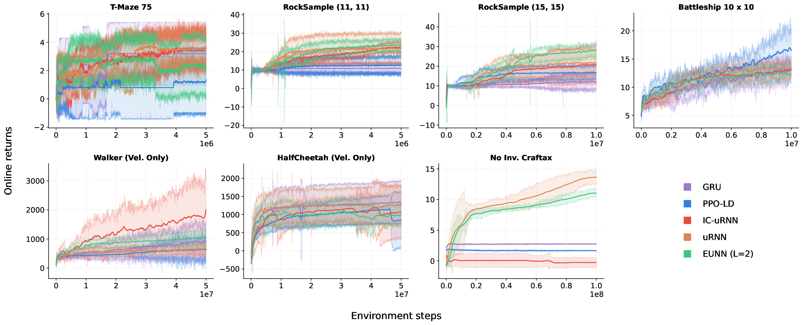

# qurl: Reinforcement Learning with Complex (valued) Memories

Code for **"Reinforcement Learning with Complex (valued) Memories"** by Sathya Kamesh Bhethanabhotla, Efstratios Gavves and André Biedenkapp, accepted at **EWRL 2026**.

`qurl` replaces the GRU in recurrent PPO with unitary recurrent networks, whose hidden state is complex-valued and whose recurrent transition is unitary. It provides three drop-in cells (uRNN, the input-conditioned ICuRNN and the tunable EUNN) and a phase-aware **Born-rule** policy head that samples actions from the squared amplitudes of a complex projection of the hidden state. Everything is written in [JAX](https://github.com/jax-ml/jax).


*Online returns of the uRNN variants against the GRU and PPO-LD baselines on 7 memory-improvable tasks from POBax.*

## Methods

| `--method` | Paper name | Memory | Policy head |
|---|---|---|---|
| `gru` | GRU (baseline) | GRU | MLP |
| `ppo_ld` | PPO-LD (baseline) | GRU + λ-discrepancy critic | MLP |
| `urnn` | uRNN | constant unitary U = D₃R₂F⁻¹D₂ΠR₁FD₁ | MLP on [Re h, Im h] |
| `icurnn` | ICuRNN | input-conditioned U(xₜ) | MLP on [Re h, Im h] |
| `eunn_2` | EUNN (L=2) | tunable EUNN, capacity L | MLP on [Re h, Im h] |
| `qurnn`, `qicurnn`, `qeunn_2` | QuRNN, QICuRNN, QuEUNN | as above | Born rule |

The Born-rule (`q`) variants support discrete action spaces only.

## Installation

```bash
git clone https://github.com/Sathya98/qurl.git && cd qurl
uv venv --python 3.10 && source .venv/bin/activate
uv pip install -e ".[cuda]"          # CPU only: uv pip install -e .
uv pip install -e ".[craftax]"       # needed for No-Inventory Craftax
```

Tested with Python 3.10. Run the tests with `uv pip install -e ".[dev]" && python -m pytest`.

## Reproducing the paper

`qurl.run` trains one (method, environment) pair with the paper's hyperparameters (5 seeds, vmapped on one GPU):

```bash
python -m qurl.run --method icurnn --env rocksample_11_11
python -m qurl.run --method qeunn_2 --env tmaze_75 --dry_run     # print the resolved command only
python -m qurl.run --method gru --env battleship_10 --n_seeds 3  # any training flag overrides the paper setting
```

Pass `--platform cpu` on a machine without a GPU. Results are saved as Orbax checkpoints under `./results/<method>_<env>/` (or `$QURL_RESULTS_DIR`).

All settings come from Appendix E of the paper and live in [`qurl/configs/`](qurl/configs/): shared and per-environment settings in `envs.yaml`, tuned unitary-method settings in `best/`. [`tests/test_paper_configs.py`](tests/test_paper_configs.py) pins them to the paper's tables. The baselines use POBax's tuned settings, and no method is tuned on Craftax.

For SLURM, [`scripts/slurm_example.sbatch`](scripts/slurm_example.sbatch) runs one pair per job:

```bash
sbatch --partition=<gpu_partition> --time=36:00:00 \
       --export=ALL,METHOD=icurnn,ENV_NAME=rocksample_11_11 scripts/slurm_example.sbatch
```

Results are only written at the end of a run, so the walltime must cover the whole run (Craftax, at 100M steps, takes longest).

**Notes.** `qurl` reproduces the code as it was run for the paper. Where it differs from the wording of Appendix E:
- RockSample (15, 15) trained with γ = 0.99; the environment ignores the 0.999 in its config.
- The learning-rate anneal applies to both the real and the complex parameter groups.
- Craftax runs do not append the previous action to the observation.

## Environments

| Environment | `--env` | Methods |
|---|---|---|
| T-Maze (corridor 75) | `tmaze_75` | all |
| RockSample (11, 11) | `rocksample_11_11` | all |
| RockSample (15, 15) | `rocksample_15_15` | all |
| Battleship (10 × 10) | `battleship_10` | all |
| Masked Walker (velocity only) | `Walker-V-v0` | non-Born-rule |
| Masked HalfCheetah (velocity only) | `HalfCheetah-V-v0` | non-Born-rule |
| No-Inventory Craftax (pixels) | `craftax_pixels` | all |

The rest of the POBax suite (other T-Maze lengths, DMLab Minigrid mazes, other masked MuJoCo tasks, …) is also included and can be trained directly with `python -m qurl.algos.ppo --env <id> ...` (see `--help`).

## Acknowledgements

The environments, the recurrent PPO / PPO-LD training code and the baseline settings are borrowed from [POBax](https://github.com/taodav/pobax).

## Citation

```bibtex
@inproceedings{bhethanabhotla2026complex,
  title     = {Reinforcement Learning with Complex (valued) Memories},
  author    = {Bhethanabhotla, Sathya Kamesh and Gavves, Efstratios and Biedenkapp, Andr{\'e}},
  booktitle = {19th European Workshop on Reinforcement Learning (EWRL)},
  year      = {2026}
}
```

## License

Apache-2.0 (see [`LICENSE`](LICENSE)). `qurl` is derived from [POBax](https://github.com/taodav/pobax) (Apache-2.0); files under `qurl/` were modified from the original.
